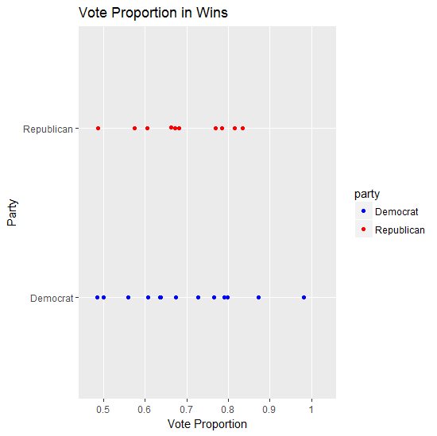
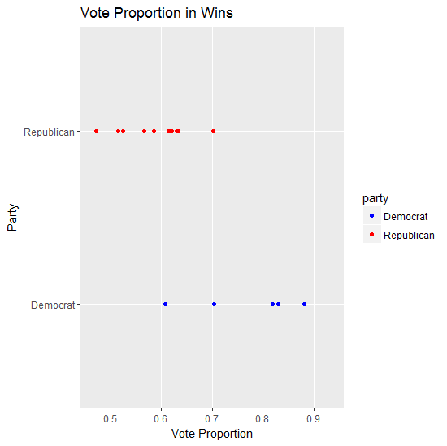
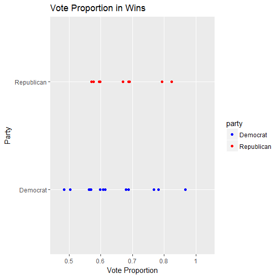
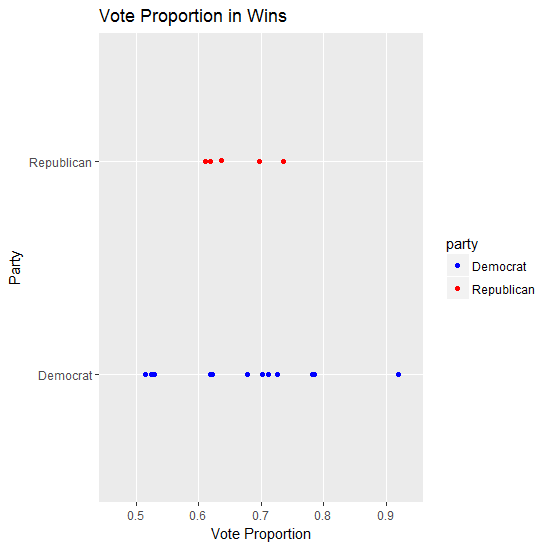

## Introduction

Gerrymandering refers to the practice of redrawing the boundaries of an electoral constituency to favor a chosen group, typically a racial group or political party. In the United States, most states require electoral districts to be redrawn every ten years, coinciding with the decennial U.S. census. Ostensibly, this process is meant to update districts according to demographic change, but in many states the redistricting process is controlled by the political party in power. As such, political parties looking to consolidate their power may use the redistricting process to draw districts that put their representatives in favorable elections. 

In recent years, growth in computing power and openly accessible data has contributed to an increased interest in quantifying gerrymandering. The issue of gerrymandering is especially vital today, as the Supreme Court is due to decide on multiple gerrymandering cases in 2017. However, the government still has yet to settle the question of how precisely to measure and define gerrymandering. What does gerrymandering look like in a heavily Republican state? Or a perennially contested swing state? Many political scientists and statisticians have proposed tests and metrics for identifying and defining gerrymandering; for our project, we have replicated some of these measures of gerrymandering and hope to compare and contrast them.

## Guiding Example

Following the 2010 U.S. Census, the North Carolina state legislature (controlled by Republicans at the time) approved a new redistricting plan. Democrats and some critics complained that Republicans had worked to pack, or concentrate, Democratic voters in a few, heavily Democratic districts, while distributing Republican votes in such a way to give Republicans a narrow but stable lead in the remaining districts (a practice commonly referred to as cracking and packing). These critics would go on to point to the Democrats' poor showing in the 2012 Congressional elections as a reflection of the unfair redistricting process. [^1]

[^1]: Ballotpedia.

To (naively) evaluate this claim, we used the efficiency gap measure proposed by Nicholas Stephanopoulos and Eric McGhee (2015). Simply put, the efficiency gap measures the difference between the number of votes wasted by Democrats and the number of votes wasted by Republicans. Wasted votes are those cast for losing candidates added to those cast for winning candidates above the number needed to win an election, i.e. the superfluous votes. The absolute difference in wasted votes between the two parties is divided by the total votes cast in the election in the state in order to enable comparison. We calculated the efficiency gap for elections from 2006-2016 (note that we calculated our efficiency gap by subtracting Republican wasted votes from Democratic wasted votes, so a positive efficiency gap reflects unfavorable conditions for Democrats)

```{r, echo = F, cache = T, fig.height = 3.5}
hr2016 <- read.csv("C:/Users/pgao/Dropbox/Winter 2017/Multiple Testing/2016_NC_USHR_summary.csv")
hr2014 <- read.csv("C:/Users/pgao/Dropbox/Winter 2017/Multiple Testing/2014_NC_USHR_summary.csv")
hr2012 <- read.csv("C:/Users/pgao/Dropbox/Winter 2017/Multiple Testing/2012_NC_USHR_summary.csv")
hr2010 <- read.csv("C:/Users/pgao/Dropbox/Winter 2017/Multiple Testing/2010_NC_USHR_summary.csv")
hr2008 <- read.csv("C:/Users/pgao/Dropbox/Winter 2017/Multiple Testing/2008_NC_USHR_summary.csv")
hr2006 <- read.csv("C:/Users/pgao/Dropbox/Winter 2017/Multiple Testing/2006_NC_USHR_summary.csv")


efficiency.gap.nc <- function (data) {
  rep.wasted <- 0
  dem.wasted <- 0
  for (race in levels(data$contest.name)){
    needed <- .5*sum(subset(data, (contest.name == race) & (party.name == 'DEM' | party.name == 'REP'))$total.votes)
    dem.votes <- subset(data, (contest.name == race) & (party.name == 'DEM'))$total.votes
    rep.votes <- subset(data, (contest.name == race) & (party.name == 'REP'))$total.votes
    if (dem.votes > rep.votes){
      rep.wasted <- rep.wasted + rep.votes
      dem.wasted <- dem.wasted + (dem.votes - needed)
    } else {
      rep.wasted <- rep.wasted + (rep.votes - needed)
      dem.wasted <- dem.wasted + dem.votes
    }
  }
  gap <- (dem.wasted - rep.wasted)/(dem.wasted + rep.wasted)
  return (gap)
}
pre <- c(efficiency.gap.nc(hr2006),efficiency.gap.nc(hr2008), efficiency.gap.nc(hr2010))
post <- c(efficiency.gap.nc(hr2012), efficiency.gap.nc(hr2014), efficiency.gap.nc(hr2016))

plot(seq(2006, 2016, 2), c(efficiency.gap.nc(hr2006),efficiency.gap.nc(hr2008), efficiency.gap.nc(hr2010),
                           efficiency.gap.nc(hr2012), efficiency.gap.nc(hr2014), efficiency.gap.nc(hr2016)),
     ylab = 'efficiency gap', xlab = 'year', main = "Figure 1. Efficiency Gap (D - R) in NC Congressional Race")
```

We could also try to perform a two-sample $t$ test, but we note that elections are not independent of each other, making such a test unusable. As such, this example illustrates a fundamental problem in thinking about gerrymandering: even when a trend appears to reflect gerrymandering, the complexity of politics, geography, and demography make it difficult to set a universal fair standard against which we could compare potentially gerrymandered districts. Even if we could establish that the efficiency gap was significantly different post-2010, we would still need to come to the consensus that efficiency gap is an effective way to measure gerrymandering.

## Methods Implemented

For all of the methods below, we have been able to calculate values for Pennsylvania elections up to 2012, but we have yet to establish a basis for comparing them. 

### Efficiency Gap (Stephanopoulos and McGhee 2015)

As outlined above, the efficiency gap measures the difference in wasted votes. Wasted votes are those cast for the losing candidate in a race and those cast for a winning candidate in excess of what is needed to win. By adding up the wasted votes for each party and calculating the difference, the efficiency gap aims to measure how favorable a redistricting plan is for each party. In particular, the efficiency gap would seem likely to work well at recognizing when a party implements a "pack-and-crack" plan, which concentrates opposition voters in a small number of heavily majority-opposition districts while maintaining a small majority in the rest of districts. Under such a plan, a redistricting party would waste very few votes, winning many races by a small number of votes and losing a small number of races by a huge gap.

Mathematically, we can calculate the efficiency gap for party $A$ as follows: 
  $$
  \text{ Efficiency Gap}(A,B)=\frac{\#\textrm{wasted}(A)-\#\textrm{wasted}(B)}{
  \#\text{votes}
  }
  $$

Though the efficiency gap is elegant and simple to calculate, some commenters have raised concerns that the efficiency gap is ineffective since it is not invariant under a uniform swing of the vote (that is, it depends not on how the districts are drawn, but solely on the results of the election). In particular, critics note that it is discontinuous, with huge fluctuations for closely contested districts.[^2] We hope to simulate this in the future.

[^2]: autoredistrict.org. 

### Uniform Swing Partisan Bias (Thomas et al. 2012)

In general, measures of partisan bias seek to estimate the difference in seats won by each party given that each party wins half of the vote. However, in any real election, the two parties will almost never win precisely half the vote each. As such, the estimation of partisan bias hinges upon the reallocation of votes to simulate an "even" election. In other words, given a state in which Republicans won 60% of the votes, how can we estimate what would have occured had they only won 50%? The naive approach, which we have used here, is the uniform swing approach, in which each district is shifted by the same percentage. That is, in a state where Republicans win 60% of the vote, we shift the vote of each district down 10% to simulate an even election. We can then count the number of seats won by each party in this simulated election, dividing by the total number of seats up for election, to obtain our estimate of partisan bias.

### Lopsided Victories (Wang 2016)

If there is partisan gerrymandering then as evidence of voter packing, one party will win by large margins while the other party's will win by small margins. We use a two sided $T$ test to compare the means of the winning margin of the two parties. In order to deal with elections where one party ran unopposed, we added an imputed value parameter that represents the assumed percentage of votes that the winning party would have received had there been an opponent.  In most cases, tweaking this parameter's value does not significantly alter the p-value for a given state and year. However, it is possible that across many years and many states, the choice of imputed value is significant. We plotted the vote proportions in wins for both Democrats and Republicans for many different states and years. Some sample graphs and p-values are displayed on the following page:  


```{r, out.height = "250px", out.width = "220px", echo = F}
library(knitr)




```


These graphs correspond to PA 1984 (p-value of 0.679), PA 2012 (p-value of 0.03), IL 1984 (p-value of 0.843), and IL 2012 (p-value of 0.766) respectively from left to right.
 
 
### Partisan Bias, Revisited (Gelman and King 1994)

The three previous methods are attractive partially because they are trivial to compute. However, if we view election results as random, all of the above are simply estimates of the metrics they hope to measure. Furthermore, none of the above methods give uncertainty estimates, making it difficult to conduct inference on the results.

In contrast, Gelman and King (1994) offer a statistical framework for modeling elections and estimating properties like partisan bias. This enables them to construct confidence intervals for their estimates, providing much-needed context for our estimates of partisan bias, for example. 

In its simplest form, Gelman and King's model proposes to measure vote shares by a linear regression model:
$$v = X\beta +\gamma+\epsilon$$
where $X$ is an $n\times k$ matrix of $k$ explanatory variables, $\beta$ is a vector of $k$ parameters, $\gamma$ is an error vector corresponding to systematric differences between districts, and $\epsilon$ is an error vector corresponding to random error. As such $\gamma\sim N(0, \lambda\sigma^2I_n)$ and $\epsilon\sim N(0, (1-\lambda)\sigma^2I_n)$.

Gelman and King advise a Bayesian approach to fitting the model, setting uniform priors on $\beta$ and $\sigma^2$. Notably, they advise that estimates should be pooled across several election years to obtain more accurate estimates of $\sigma^2$ and $\lambda$. (It seems they assume that the variability of elections is constant over time). The interpretation of $\lambda$ is clearer if we suppose that we could repeat elections to obtain hypothetical vote shares. 

We could model 
$$v^{h} = X^h\beta +\delta^h +\gamma+\epsilon^h$$
where $\delta^h$ corresponds to the universal uniform partisan swing and $X^h$ and $\epsilon^h$ correspond to the hypothetical analogues of $X$ and $\epsilon$. 

If $\lambda = 1$, then every hypothetical vote share should be equal to the actual observed vote share (since the variation between districts is captured entirely in $\gamma$). This is analogous to the uniform swing partisan bias approach. If $\lambda = 0$, then every district is equally likely to produce a given election, since there are no systematic differences between districts. 

After fitting their model, Gelman and King outline an algorithm for simulating elections in a given year, in a given district. From these simulations, they derive estimates of uncertainty. We can simulate by estimating $\gamma_i$ from our actual observed election, and then, once we have estimates of $\beta$ and $\gamma_i$, we can input new values of $X^h$, $\delta^h$ and randomly generate $\epsilon^h$ to generate new election outcomes $v^h$. 

From these hypothetical election outcomes, we obtain a distribution for the partisan bias of a given election. Gelman and King have implemented this method in the ```JudgeIt``` package in ```R```; we have been able to approximately reproduce their results to produce the following graph of partisan bias in U.S. House elections in non-Southern states. Positive values of bias correspond to favorable conditions for Democrats. As Gelman and King noted in their 1994 paper, there appears to be a sustained period of Republican-biased elections in the mid 1900s and a gradually increasing bias in favor of the Democrats in the latter third of the century. 

```{r, echo = F, cache = T, out.height = "250px"}

library(JudgeIt)
data("house6311")
year = seq(1896, 1992, 2)
unc <- function(inp) -1*(inp<0.05)+1*(inp>0.95)
elecyears <- as.numeric(names(house6311))
j.obj <- judgeit(model.formula = VOTE ~ INC + unc(VOTE), data = house6311, vote.formula = TURNOUT~1, 
                 same.districts=(elecyears%%10!=2), subset = DELSOUTH == 0)

a <- c()
for (i in seq(1896, 1992, 2)) {
  a <- c(a, bias.resp(j.obj, year = i)$svsums[2,1])
}

plot(seq(1896, 1992, 2), a, type = 'l', xlab = 'Year', ylab = 'Partisan Bias', main = 'U.S. House (1896-1992), Non-South')
```

## Early Comparisons

First, we note that these metrics vary in their dependence upon actual election results. In theory, partisan bias is a function of election boundaries and the corresponding voters in each district, independent of any recorded election results. On the other hand, the efficiency gap and lopsided victories methods are tied directly to actual election results. Neither of these approaches is necessarily inferior, but they do reflect different ways to measuring gerrymandering. Estimating partisan bias requires us to consider a counterfactual election that has not occured whereas the other aforementioned methods rely only on actual elections. 

Another split is between methods that produce a definitive test statistic and conclusion, like the lopsided victories test, and methods that simply offer an unstandardized measure of some notion of gerrymandering, like partisan bias and the efficiency gap. We hope to further investigate ways in which we can establish some baseline or perhaps even a null distribution for evaluating efficiency gap or partisan bias.

## Future Plans

For our final project, we hope to flesh out our understanding of these methods and offer further comments and critiques of each method. In particular, we note that many of these methods can be linked through the seats-votes curve, a common type of graph in the gerrymandering literature that plots vote margins versus seat margins. Specifically, a one percent increase in vote share may not necessarily lead to a one percent increase in seat share. However, it is unclear what the optimal relationship between vote share and seat share (often referred to as electoral responsiveness) is. 

We hope to use simulations to illustrate some of the strengths and flaws of each method. For example, what happens to efficiency gap in a state with many closely contested states? What about partisan bias? How do recent election results compare with historical trends?

Finally, we note that gerrymandering is sometimes benign or even beneficial. Some researchers like Gelman and King (1994) have suggested that it may not be as harmful as it is commonly depicted as being. For example, voting rights laws have mandated the creation of majority-minority districts in order to protect minority constituents. This necessarily entails some form of packing. We will need to keep in mind that measuring and quantifying gerrymandering should not be entirely context free.